# VSCode のインストールと Hula への接続

VSCode（Visual Studio Code）は、マイクロソフトが開発した無料のコードエディターです。動作が軽く、豊富な拡張機能を追加することで、さまざまなプログラミング言語や開発環境に対応させることができます。

このページでは、Windows 版 VSCode のインストールから、日本語化・Python 環境の準備、そしてドローン「Hula」への接続までを順を追って説明します。

##  インストーラーのダウンロード

まず、公式サイトにアクセスし、「Download for Windows」ボタンからインストーラーをダウンロードします。

公式サイト: https://code.visualstudio.com/

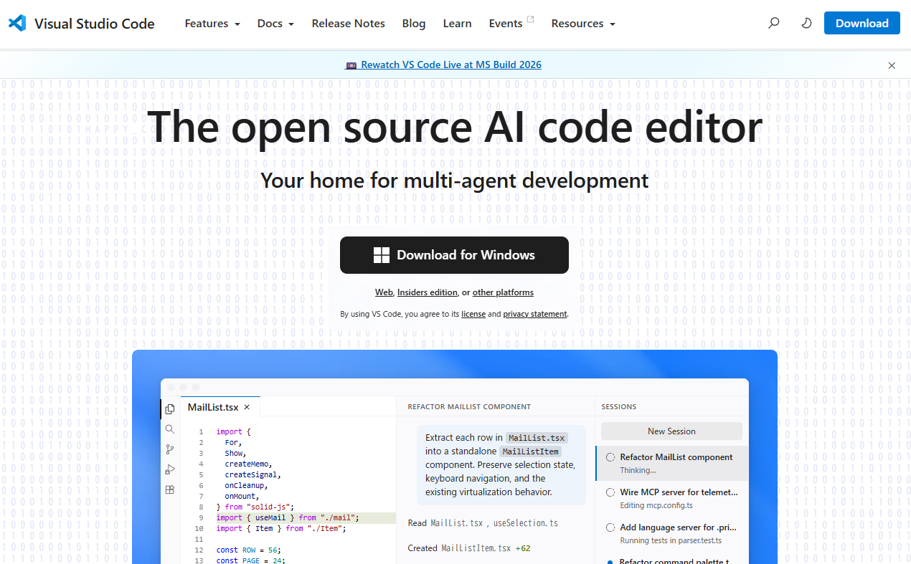

##  インストーラーの実行

ダウンロードした `***.exe` ファイルを保存し、ダブルクリックして実行します。

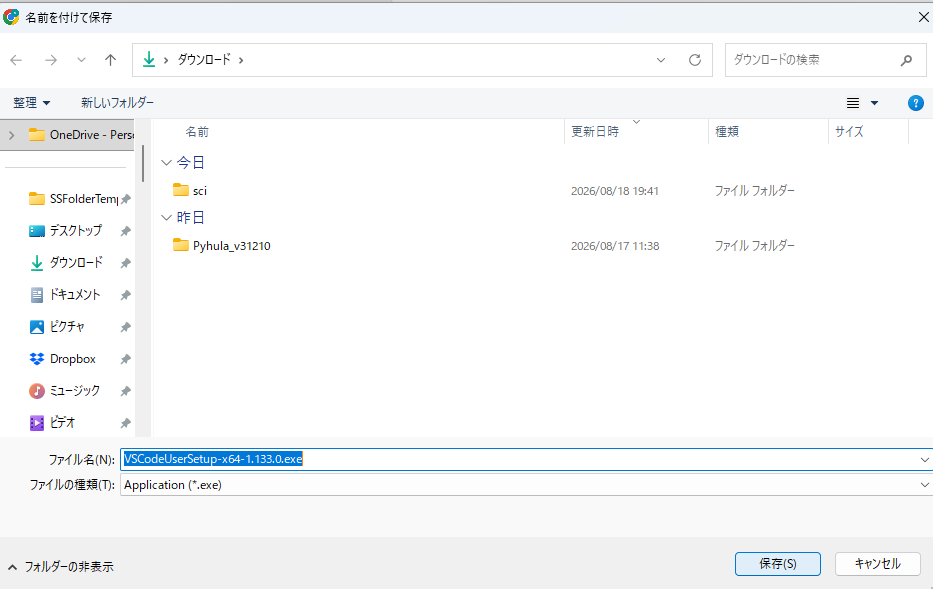

## 3. ライセンスへの同意

使用許諾契約書（ライセンス事項）の内容を確認し、「同意する」を選択して「次へ」を押します。

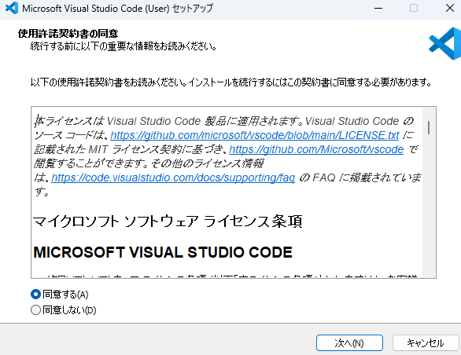

## インストール設定

基本的にはそのまま「次へ」を押して進めます。必要に応じて、インストール先のフォルダーやショートカットの作成などをカスタマイズすることもできます。

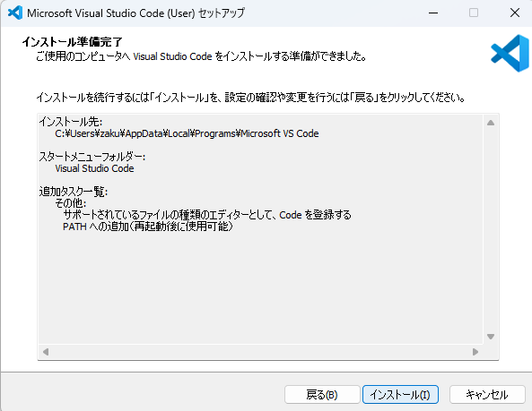

##  インストールの完了

設定内容を確認したら「インストール」を押し、処理が完了するまで待ちます。完了したら「完了」を押してインストーラーを閉じます。

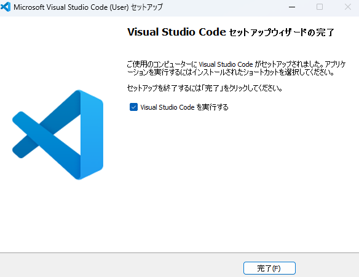

##  日本語化（拡張機能の導入）

VSCode は拡張機能で日本語化できます。左側の「拡張機能（Extensions）」アイコンを押し、検索欄に「japanese」と入力してください。表示されたマイクロソフト製の日本語化拡張機能（Japanese Language Pack）をインストールします。

導入したあとは、VSCode を再起動すると日本語表示が反映されます。

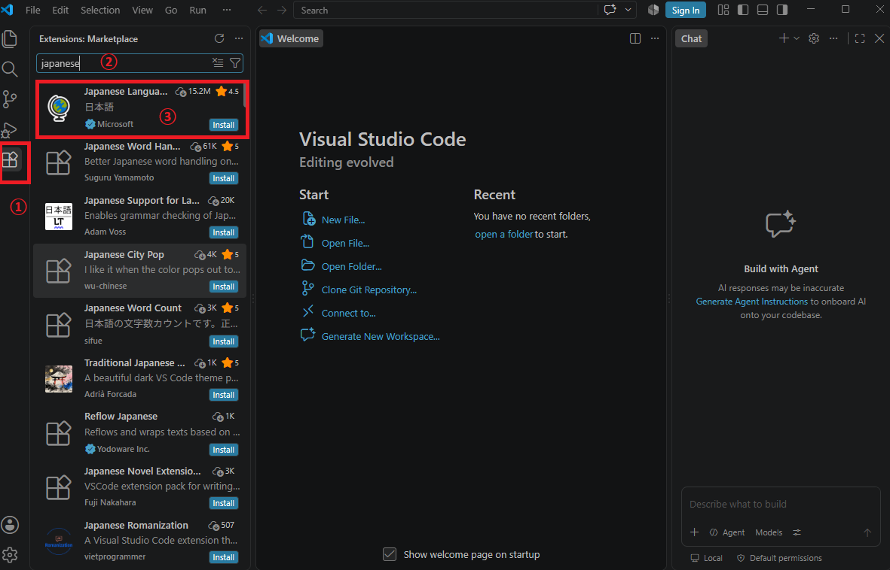

##  Python 拡張機能の導入

続いて、Python を扱うための拡張機能を導入します。同じく「拡張機能」の検索欄に「Python」と入力し、マイクロソフト製の Python 拡張機能をインストールしてください。

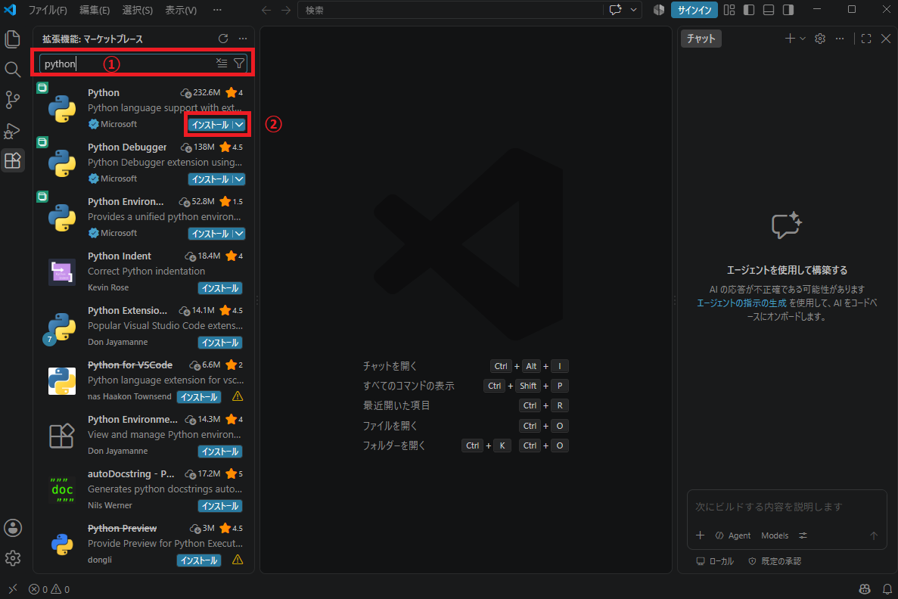

##  作業フォルダーの作成

VSCode はフォルダーを規定して作業することができます。ここでは例としてデスクトップに「drone」というフォルダーを作成し、その中に「test.py」というファイルを作成してください。
デスクトップで右のクリックを押して、フォルダーを押してください。

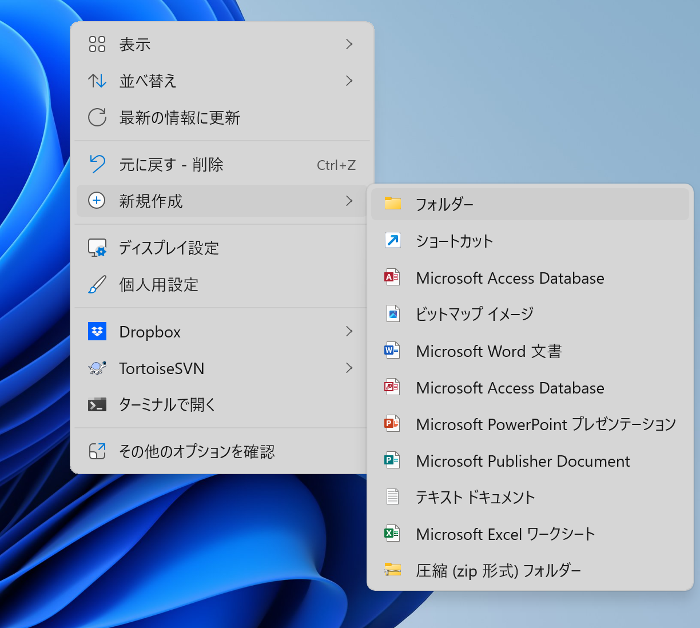

フォルダーの名前は「ドローン」に設定してください。

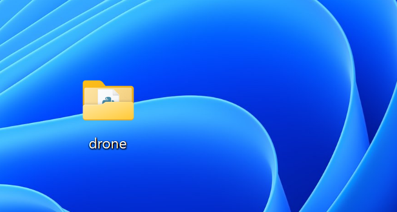

「ファイル」の「フォルダーを開く...」を選択してください。

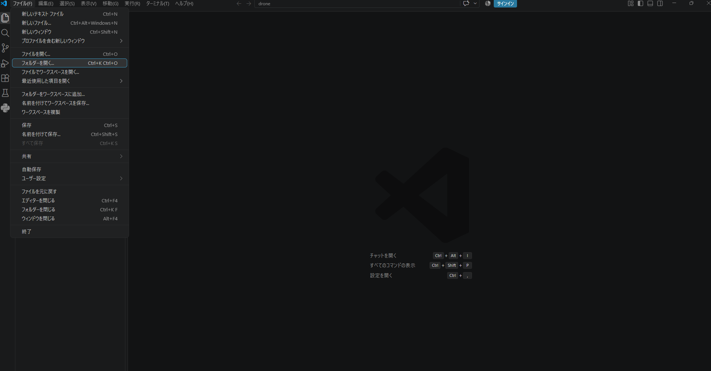

先ほど作成した「drone」のフォルダーを選択してください。

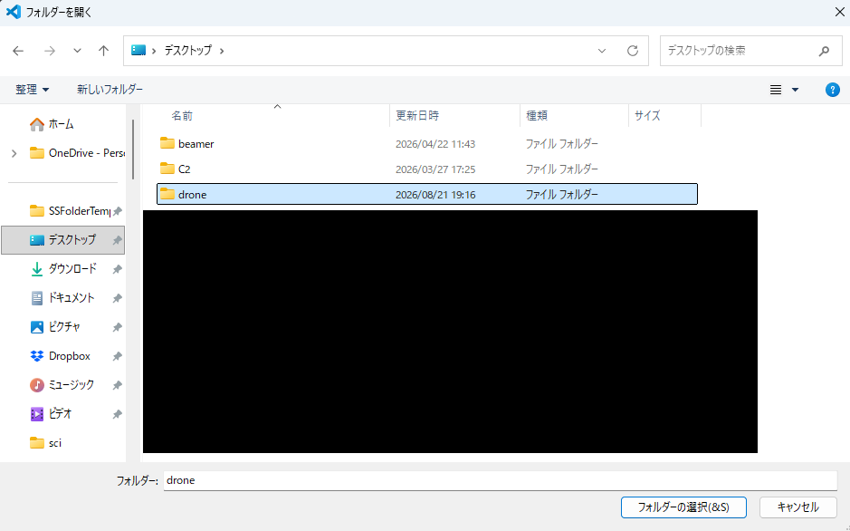

「エクスプローラー」の「新しいファイル..」を教えてください。
ファイル名は「test.py」としてください。

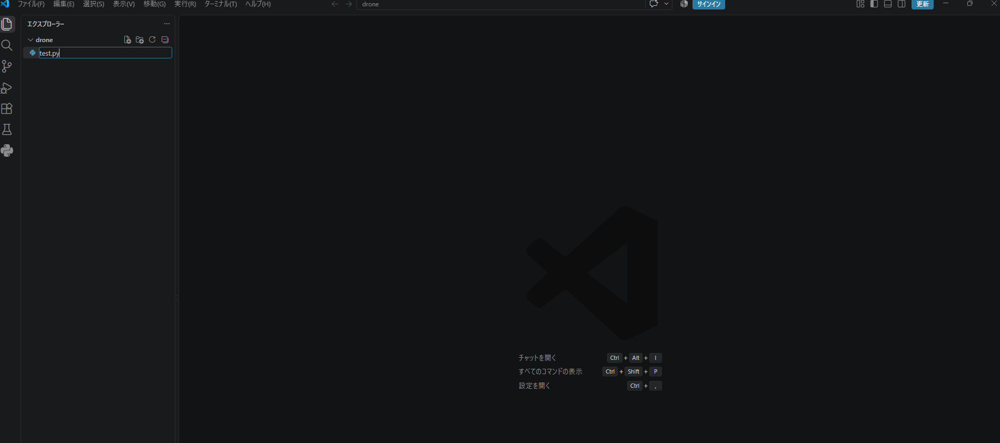

ファイルを作成したあとに以下のコードをコピーして
「test.py」に貼り付けてください。

```python
import pyhula

api = pyhula.UserApi()
if not api.connect():
    print("connect error")
else:
    print("connection to station by wifi")
```
入力すると以下のような画面が表示されます。

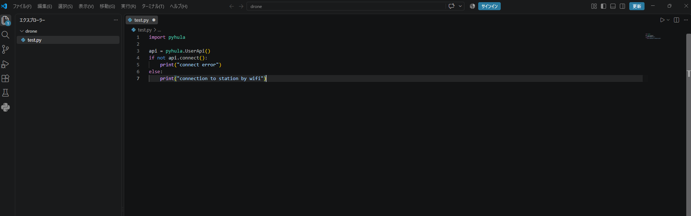

##  Hula への Wi-Fi 接続と確認

Hula 本体の裏面に SSID が記載されています。パソコンの Wi-Fi 設定から、その SSID に接続してください。

パスワードは「12345678」です。

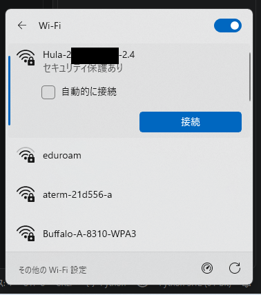


Wi-Fi の接続が完了したら、再生マークの実行ボタンを教えてください。


Hula への接続に成功すると、VSCode 下部の出力（ターミナル）部分に「connection to station by wifi」と表示されます。

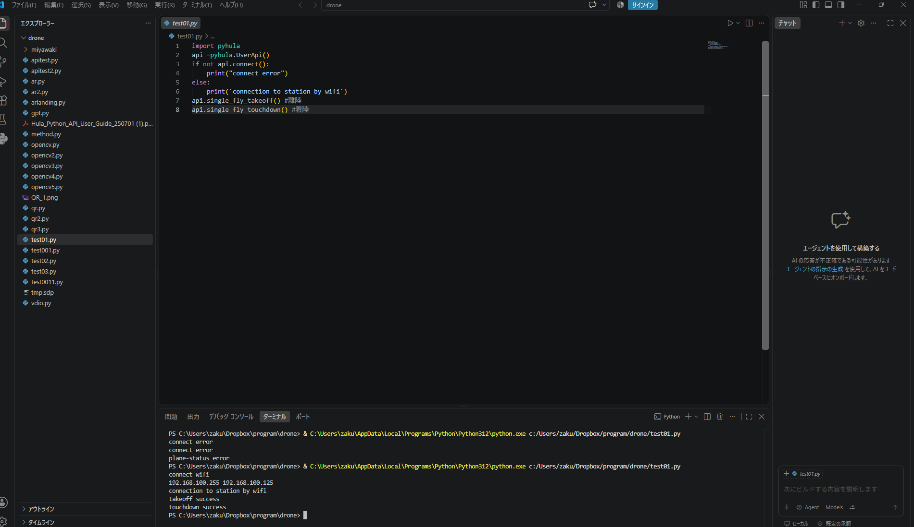

以上で、VSCode の設定と Hula への接続は完了です。
